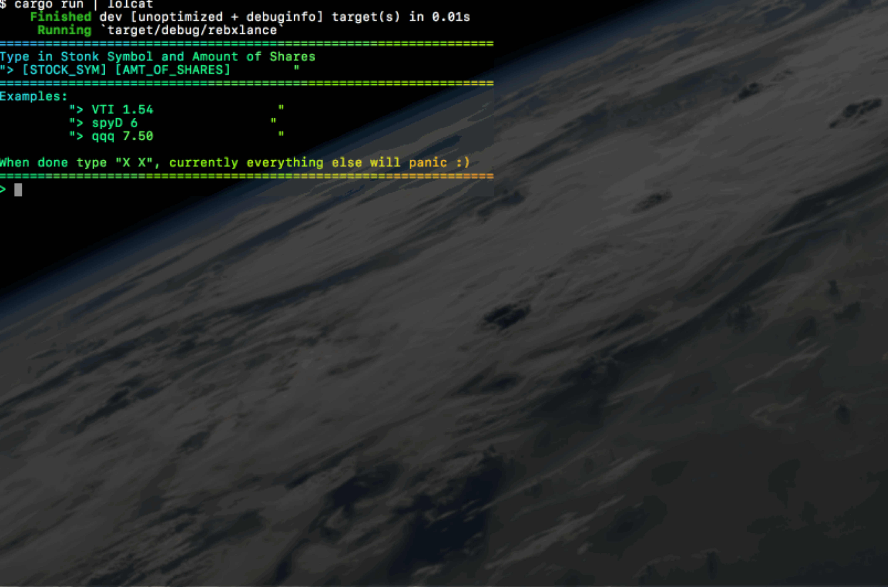
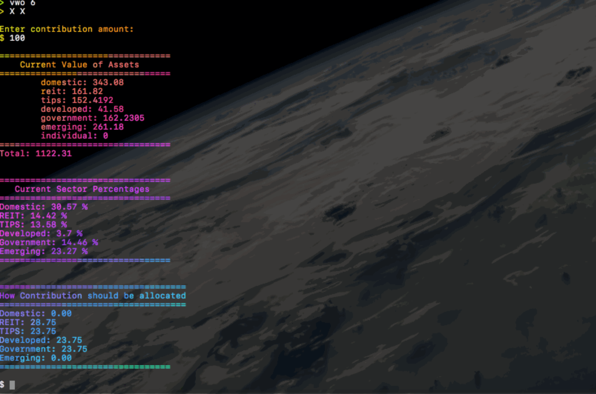
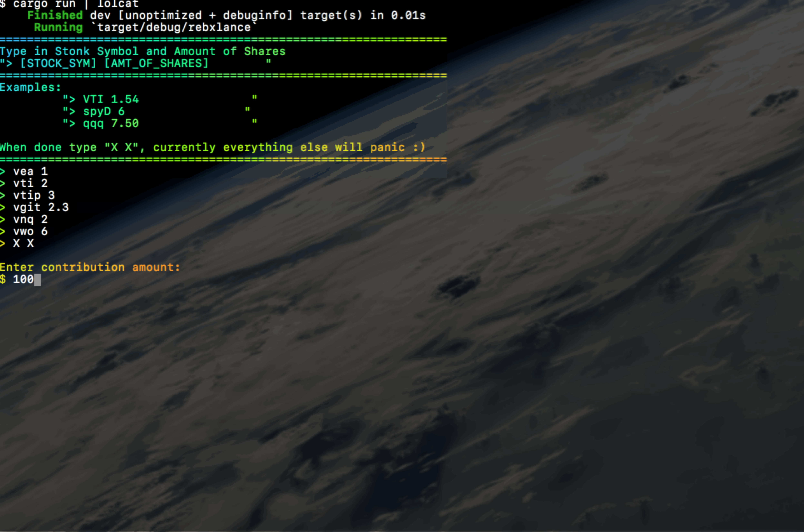

# rebxlance

Portfolio Rebalancing in the Terminal 


## To Prepare for use:
```sh
# Getting the repo
git clone https://github.com/AOrps/rebxlance.git

# Changing Directory to repo
cd rebxlance/
```

##  To Run:
```sh
# For Debug Mode (No Compilation)
go run main.go

# To Compile
go build main.go
```

## To Use: 
| Start Display             | End Result
|:---------------------|:------------
||

|Example
|:----------
|

|In action:
|:---------------------
|

### Disclaimer:
* I simply piped the executable through lolcat. Text will not show up in rainbow colors.

## Limitations
* Does not have all the stocks, and the stocks for the sectors is hard-coded for performance reasons. Some code could be considered needlessly repetitive / verbose. 

* Uses a basic portfolio rebalancing technique. It may not yield the top or smartest rebalancing method. **~ Greedy and Simple Approach**


* Will not even begin to rebalance non-Index ETFs/Stocks. **Use Index**


## Author 
* AOrps
